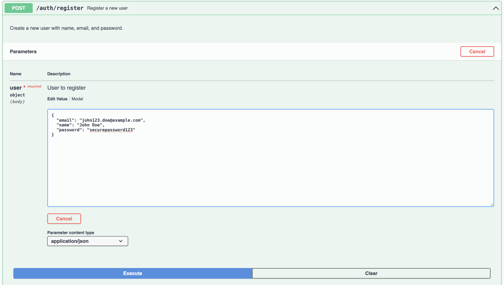

# Документация для тестового задания GitVerse: Микросервисная система рекомендаций

## Контакты: 
* Субботина Анастасия
* https://t.me/@nasliiis
* +7-920-446-61-98
* email: anastasia.subbotina1998@gmail.com
* [github.com/nasl1s](https://github.com/nasl1s)

---
## Задача
Разработать систему рекомендаций, состоящую из минимум 4-ех микросервисов, взаимодействующих через **Apache Kafka**. Использовать **реляционную базу данных (PostrgeSQL)** для хранения данных и **Redis** для кэширования. Все сервисы должны запускаться через **Docker Compose**.

## Описание сервиса рекомендаций

-   Сервис пользователей (_User Service_)
-   Сервис продуктов (_Product Service_)
-   Сервис рекомендаций (_Recommendation Service_)
-   Сервис аналитики (_Analytics Service_)
-   Сервис аутентификации (_SSO Service_)

1.  **User Service**:
    
    -   API для управления пользователями (регистрация, обновление профиля).
    -   Отправка событий о пользователях в Kafka (топик `user_updates`).

Сервис управления пользователями предоставляет API для регистрации, обновления профиля и взаимодействия с продуктами. Пользователи могут лайкать, дизлайкать и покупать товары, а также запрашивать историю своих действий. Все действия пользователей отправляются в Kafka (`user_updates`) для дальнейшей обработки в других сервисах. Эти данные сохраняются в PostgreSQL, что позволяет формировать историю взаимодействий.

При лайке, дизлайке или покупке отправляются соответствующие события в Kafka. Лайк увеличивает вес категории, дизлайк снижает, а покупка добавляет значительный прирост. Эти события анализируются другими сервисами, например, Recommendation Service, для формирования рекомендаций.

2.  **Product Service**:
    
    -   API для управления продуктами (добавление, обновление, удаление).
    -   Отправка событий о продуктах в Kafka (топик `product_updates`).

Сервис управления продуктами предоставляет API для добавления, редактирования, получения информации о продуктах и удаления товаров. При изменении данных о продукте (создание, обновление, удаление) события отправляются в Kafka (`product_updates`). Эти события используются другими микросервисами, например, Recommendation Service и Analytics Service.

Данные о продуктах хранятся в PostgreSQL и могут быть обновлены или удалены по запросу через API.

3.  **Recommendation Service**:
    
    -   Подписка на `user_updates` и `product_updates`.
    -   Генерация рекомендаций на основе данных пользователей и продуктов.
    -   Сохранение рекомендаций в базе данных.
    -   API для получения рекомендаций (с проверкой кэша).

Сервис рекомендаций анализирует действия пользователя (лайки, дизлайки, покупки), отправленные через Kafka, чтобы определить его предпочтения. На основе этих событий обновляются веса категорий в пользовательском профиле: лайки увеличивают вес категории, дизлайки уменьшают, а покупки дают максимальный прирост. Эти данные хранятся в PostgreSQL и используются для формирования релевантного набора топ-категорий.

Для генерации рекомендаций сервис выбирает актуальные продукты из топ-категорий, сортирует их по времени обновления и формирует список рекомендаций. Результат кэшируется в Redis для ускорения последующих запросов. Если пользователь запрашивает рекомендации, сначала проверяется кэш, а если данных нет, выполняется запрос к базе. Такой подход обеспечивает быстрое и персонализированное предоставление рекомендаций.

4.  **Analytics Service**:
    
    -   Подписка на события из всех микросервисов.
    -   Сбор статистики по популярности продуктов и активности пользователей.
    -   Хранение аналитических данных в базе.

Сервис аналитики подписывается на события из всех микросервисов для сбора статистики по активности пользователей и популярности продуктов. Данные о лайках, дизлайках, покупках и обновлениях продуктов анализируются и сохраняются в PostgreSQL. 

5.  **SSO Service**:
    
    -  Регистрация юзеров
    -  Аутентификация юзера - выдача JWT токена.

Сервис единой авторизации (SSO) предоставляет функционал регистрации пользователей и их аутентификации. При регистрации пользовательские данные сохраняются в базе данных, а при успешной аутентификации выдается JWT токен, который используется для авторизации в других микросервисах.

#### Схема связей таблиц базы данных:
##### Основные таблицы:
USERS и PRODUCTS являются центральными таблицами.
Все действия и статистика связаны с этими таблицами через внешние ключи.

##### Связи:
RECOMMENDATIONS связывает пользователей с продуктами, предоставляя рекомендации.
PURCHASES, LIKES, и DISLIKES фиксируют действия пользователей по отношению к продуктам.
STATISTICS и PRODUCT_ANALYTICS отслеживают показатели для продуктов.
USER_ANALYTICS и USER_CATEGORY_PREFERENCES содержат аналитику и предпочтения пользователей.

##### Уникальные связи:
Каждая пара user_id и product_id уникальна в LIKES и DISLIKES.
В USER_CATEGORY_PREFERENCES каждая категория пользователя уникальна.

#### Система кэширования
##### Принцип работы

Система кеширования в приложении используется для ускорения доступа к данным и минимизации нагрузки на базу данных. Она включает два основных механизма: составление ключей и инвалидацию кеша.

##### Составление ключа

Для каждой операции, связанной с запросом данных, формируется уникальный ключ кеша. Ключи определяются по шаблонам, которые однозначно идентифицируют данные:

- **Пользователи**: `user:{id}`, где `{id}` — идентификатор пользователя.
- **Рекомендации**: `recommendations:user:{id}`, где `{id}` — идентификатор пользователя.

Ключи создаются на основе параметров запроса. Например, для запросов с пагинацией параметры `limit` и `offset` могут быть добавлены к ключу, чтобы точно идентифицировать результат.

##### Извлечение данных

1. **Поиск в кеше**: 
   При каждом запросе система сначала проверяет наличие данных в Redis. Если данные найдены (кэш-хит), они извлекаются и возвращаются без обращения к базе данных.

2. **Запрос в базу данных**: 
   Если данные отсутствуют в кеше (кэш-мисс), выполняется запрос к PostgreSQL. После получения результата данные сериализуются (например, в JSON) и сохраняются в Redis с установленным временем жизни (TTL). Это позволяет минимизировать последующие запросы к базе данных.

##### Инвалидация кеша

Инвалидация кеша выполняется, когда данные обновляются в базе данных. Для обеспечения актуальности данных соответствующий ключ удаляется из Redis. Примеры:

- **Обновление пользователя**: При изменении профиля удаляется ключ `user:{id}`.
- **Обновление рекомендаций**: После генерации новых рекомендаций для пользователя удаляется ключ `recommendations:user:{id}`.

После удаления старого кеша обновленные данные записываются в Redis при следующем запросе. Инвалидация также выполняется при публикации событий в Kafka, чтобы изменения синхронизировались с другими сервисами.

---

#### ELK Stack

1. **Сбор логов**: 
   Filebeat собирает логи из указанных сервисов. Для этого в конфигурации Filebeat задаются пути к лог-файлу.

2. **Отправка логов в Elasticsearch**: 
   Filebeat обрабатывает собранные логи, добавляет метаданные (например, имя файла, хост), и отправляет их в Elasticsearch.

3. **Создание Index Pattern в Kibana**
* Шаг 1. Открытие Index Management: В интерфейсе Kibana перейдите в раздел "Stack Management" → "Index Patterns".

* Шаг 2. Создание Index Pattern:
Нажмите "Create index pattern".
В поле ввода укажите шаблон индекса: logs_*.
* Шаг 3. Настройка временной метки:
В списке выберите поле @timestamp как временную метку.
Нажмите "Create index pattern"


---
## Технологии

-  **Golang** — основной язык разработки.
-  **Fiber** — фреймворк для REST API.
-  **Kafka** — система обмена сообщениями.
-  **PostgreSQL** — база данных.
-  **Redis** — база данных для кэширования.
-  **Docker + Docker-Compose** — для контейнеризации.
- **PGAdmin** - Web UI для Postgresql
- **ELK Stack (elasticsearch + logstash + kibana + filebeats)** - Система логирования
- **Prometheus + Grafana** - Система мониторинга
- **Swagger Open API**
- **MKDocs**

---

## Структура проекта
<details>
<summary>Нажми, что бы развернуть <---</summary>

```plaintext
.
├── Makefile
├── README.md
├── backup.sh
├── cmd
│ ├── analytics-service
│ │ ├── Dockerfile
│ │ ├── docs
│ │ │ ├── docs.go
│ │ │ ├── swagger.json
│ │ │ └── swagger.yaml
│ │ └── main.go
│ ├── product-service
│ │ ├── Dockerfile
│ │ ├── docs
│ │ │ ├── docs.go
│ │ │ ├── swagger.json
│ │ │ └── swagger.yaml
│ │ └── main.go
│ ├── recommendation-service
│ │ ├── Dockerfile
│ │ ├── docs
│ │ │ ├── docs.go
│ │ │ ├── swagger.json
│ │ │ └── swagger.yaml
│ │ └── main.go
│ ├── sso-service
│ │ ├── Dockerfile
│ │ ├── docs
│ │ │ ├── docs.go
│ │ │ ├── swagger.json
│ │ │ └── swagger.yaml
│ │ └── main.go
│ └── user-service
│ ├── Dockerfile
│ ├── docs
│ │ ├── docs.go
│ │ ├── swagger.json
│ │ └── swagger.yaml
│ └── main.go
├── configs
│ ├── config.yaml
│ ├── elasticsearch
│ │ └── config.yml
│ ├── filebeat
│ │ └── config.yml
│ ├── kibana
│ │ └── config.yml
│ ├── logstash
│ │ ├── config.yml
│ │ ├── pipelines
│ │ │ └── logger.conf
│ │ └── pipelines.yml
│ └── prometheus
│ └── prometheus.yml
├── docker-compose.yaml
├── go.mod
├── go.sum
├── internal
│ ├── analytics
│ │ ├── delivery
│ │ │ └── http
│ │ │ └── handler.go
│ │ ├── models
│ │ │ └── analytics.go
│ │ ├── repository
│ │ │ └── analytics_repository.go
│ │ └── service
│ │ └── analytics_service.go
│ ├── product
│ │ ├── delivery
│ │ │ └── http
│ │ │ └── handler.go
│ │ ├── models
│ │ │ ├── dislike.go
│ │ │ ├── like.go
│ │ │ └── product.go
│ │ ├── repository
│ │ │ └── product_repository.go
│ │ └── service
│ │ └── product_service.go
│ ├── recommendation
│ │ ├── delivery
│ │ │ └── http
│ │ │ └── handler.go
│ │ ├── models
│ │ │ └── recommendation.go
│ │ ├── repository
│ │ │ └── recommendation_repository.go
│ │ └── service
│ │ └── recommendation_service.go
│ ├── sso
│ │ ├── delivery
│ │ │ └── http
│ │ │ └── handler.go
│ │ ├── models
│ │ │ └── user.go
│ │ ├── repository
│ │ │ └── user_repository.go
│ │ └── service
│ │ └── user_service.go
│ └── user
│ ├── delivery
│ │ └── http
│ │ └── handler.go
│ ├── models
│ │ ├── dislike.go
│ │ ├── like.go
│ │ ├── purchase.go
│ │ └── user.go
│ ├── repository
│ │ └── user_repository.go
│ └── service
│ └── user_service.go
├── logger
│ └── logger.log
├── migrations
│ └── 20240101000000_create_tables.sql
└── pkg
├── auth
│ └── jwt.go
├── db
│ ├── connect.go
│ └── migrations.go
├── kafka
│ └── kafka_client.go
├── logger
│ └── elk_logger.go
└── redis
└── redis_client.go
```

</details>

## Установка и запуск
#### Запуск приложения
```bash
go mod tidy

# Билд и запуск сервисов
docker-compose up --build
или
make start
```

#### Для сборки документации swagger (собрана акутальная версия)
```bash
make swagger 
```

#### MKDocs документация
```bash
python3 -m venv venv
source venv/bin/activate
pip install mkdocs mkdocs-material mkdocs-mermaid2-plugin
or
pip install -r requirements.txt
# Для статических файлов
mkdocs build 
INFO    -  Building documentation to directory:
INFO    -  Documentation built in 1.41 seconds

# Для локального просмотра
mkdocs serve
INFO    -  Building documentation...
INFO    -  Cleaning site directory
INFO    -  Documentation built in 1.32 seconds
INFO    -  [03:26:02] Watching paths for changes: 'docs', 'mkdocs.yml'
INFO    -  [03:26:02] Serving on http://127.0.0.1:8000/
INFO    -  [03:26:07] Browser connected: http://127.0.0.1:8000/
```

Документация доступна по ссылке - http://127.0.0.1:8000/


---
## Cервисы 

 - PGAdmin: http://localhost:5050/
	 - root@root.com - login
	 - root - password
	 - dbname: postgres
	 - user: postgres
	 - host: db
	 - password: postgres
 - ELK: http://localhost:5601/
	 - username: elastic
	 - password: MyPw123
 - Grafana: http://localhost:3000/
	 - username: admin
	 - passwrod: admin
 - User-Service Swagger: http://localhost:8080/swagger/index.html
 - Product-Service Swagger: http://localhost:8081/swagger/index.html
 - Reccommendation-Service Swagger: http://localhost:8082/swagger/index.html
 - Analytics-Service Swagger: http://localhost:8083/swagger/index.html
 - SSO-Service Swagger: http://localhost:8084/swagger/index.html
 - MKDocs: http://127.0.0.1:8000/

## User-Flow

### SSO сервис 
http://127.0.0.1:8084/swagger/index.html

#### 1. Регистрация пользователя | Register user


#### 2. Аутентификация пользователя | User login


### Product сервис
http://127.0.0.1:8081/swagger/index.html

#### 1. Создание продукта | Create product 


#### 2. Список всех продуктов


### User сервис
http://127.0.0.1:8080/swagger/index.html

#### 1. Список всех пользователей


#### 2. Like/Dislike 
Реализована смена лайка и дизлайка


#### 3. Покупка товара


### Recommendation сервис
http://127.0.0.1:8082/swagger/index.html
#### Рекомендация для пользователя
 

### Analytic сервис
http://127.0.0.1:8083/swagger/index.html
#### 1. User analytics


#### 2. Product analytics


#### Database 
http://127.0.0.1:5050
##### Users


##### Products


#### ELK 
http://127.0.0.1:5601


#### Grafana
http://127.0.0.1:3000

